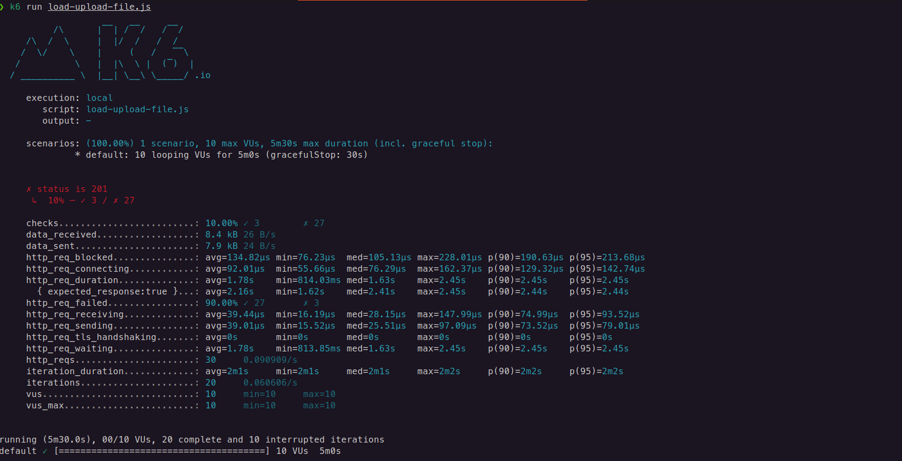
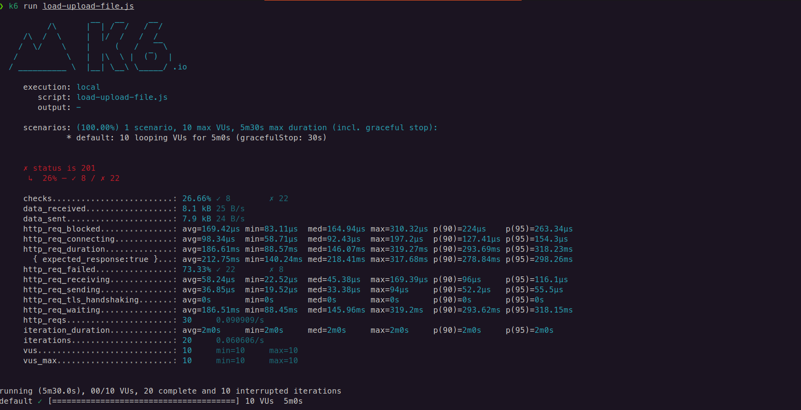

# ponderada-prog-s7

# ponderada-prog-s7

## Tecnologia utilizada e conceitos aprendidos

A tecnologia utilizada para a realização dos testes de carga foi o k6. Este, é uma ferramenta de código aberto para testar o desempenho de sistemas e aplicações, simulando cargas de usuários para avaliar como eles se comportam sob pressão. Ele fornece análises detalhadas sobre o desempenho do sistema, ajudando os desenvolvedores a identificar problemas e melhorar a eficiência.

Com a realizzação deste teste, eu pude em primeiro lugar, aprender uma nova tecnologia, pois esse foi o meu primeiro contato com a ferramenta k6. Além disso, foi muito interessante compreender o que cada métrica significava e pensar o porquê do meu teste ter dado o resultado que deu.

## Endpoint de upload de planilhas

**Cenário:** 10 usuários, 5 minutos

O endpoint testado tem o objetivo de realizar o upload de planilhas, e foram realizados 2 testes nele, um com uma planilha de 10.000 usuários, e outra com 1.000, para observar se existe alguma diferença. Além disso, vale ressaltar que esse endpoint acessa as planilhas localmente, o que justifica o os números do volume de dados enviados.

O resultado dos testes pode ser visto abaixo:

Teste com planilha de 10.000 usuários:

 

**Descrição dos resultados:**
- Desempenho:
    - Tempo médio de resposta: a requisição durou menos de 2 segundos, o que é um resultado bom, considerando a quantidade de informações a serem processadas no banco de dados
    - Tempo de espera: o tempo de espera pelo usuário foi o mesmo de resposta, sendo 1.78 segundos, que é relativamente rápido considerando o contexto.

- Conectividade:
    - Tempo bloqueado e tempo de conexão: os valores médios foram de 134.82µs para tempo bloqueado e 92.01µs para tempo de conexão. Esses tempos são muito baixos, indicando eficiência na rede e na inicialização das conexões.

- Volume de dados: 
    - Dados recebidos e enviados: a primeira vista, pode parecer que a API processou um número significante de dados, já que que recebeu 8.4kb e enviou 7.9kb, porém, a requisição não está enviando a planilha, pois esta está sendo acessada localmente. Com isso, o volume de dados da requisição se torna uma métrica não relevante nesse caso.

- Carga de trabalho:
    - Requisições por segundo: a taxa foi de 0.060606/s, com 20 iterações completas, o que demonstra que o sistema não foi capaz de lidar com a carga, e por isso o tempo foi baixo, já que só concluiu 20 interações.

- Análise geral: como é possível perceber, o teste falhou 90%, com apenas 3 de 30 usuários que realizaram a requisição com sucesso. Além disso, a métrica de carga de trabalho não teve um resultado satisfatório, já que as requisições do teste mal foram processadas. A explicação mais detalhada do resultado e qual a possível solução para resolver o problema está descrita em __"Conclusão e recomendações"__ no final da sessão.

Teste com planilha de 1.000 usuários:

 

**Descrição dos resultados:**
- Desempenho:
    - Tempo médio de resposta: considerando a quantidade baixa de dados, o fato da requisição ter durado 186.61ms é um resultado muito bom, já que o tempo é extremamente baixo.
    - Tempo de espera: o tempo de espera da requisição pelo usuário fo ide 186.51ms, o que também é um tempo extremamente baixo.

- Conectividade:
    - Tempo bloqueado e tempo de conexão: os valores médios foram de 169.42µs para tempo bloqueado e 98.34µs para tempo de conexão. Esses tempos são muito baixos, indicando eficiência na rede e na inicialização das conexões. Além disso, os tempos foram maiores do que o teste de cima, uma vez que por ser uma quantidade menor de dados, ele conseguiu processar mais requisições.

- Volume de dados: 
    - Dados recebidos e enviados: a primeira vista, pode parecer que a API processou um número significante de dados, já que que recebeu 8.1kb e enviou 7.9kb, porém, a requisição não está enviando a planilha, pois esta está sendo acessada localmente. Com isso, o volume de dados da requisição se torna uma métrica não relevante nesse caso.

- Carga de trabalho:
    - Requisições por segundo: a taxa também foi de 0.060606/s, e também concluiu apenas 20 iterações, o que demonstra que o sistema não foi capaz de lidar com a carga, e por isso o tempo foi baixo.

- Análise geral: como é possível perceber, o teste falhou em torno de 73%, com apenas 8 de 30 usuários que realizaram a requisição com sucesso, o que já é um resultado melhor que o anterior, mas ainda não está dentro das expectativas. A explicação mais detalhada do resultado e qual a possível solução para resolver o problema está descrita em __"Conslusão e recomendações"__ no final da sessão.

**Conclusão e recomendações:**
Como foi possível analisar, o sistema performou um pouco melhor com uma quantidade menor de usuários a serem inseridos no banco, mas ainda assim, o resultado foi muito abaixo do esperado para ambos os casos. Isso ocorreu, porque atualmente o sistema não está serial, ou seja, ele não tem a capacidade de realizar o processo de relação entre o "Customer" e a "Company" ao mesmo tempo que outros usuários estão subindo novas bases de dados. Pensando nisso, algo que melhoraria o resultado seria a implementação de filas, pois ela permite que o processo de criar uma relação seja processada um de cada vez, sendo assim, o sistema processaria apenas uma base de dados por vez.
